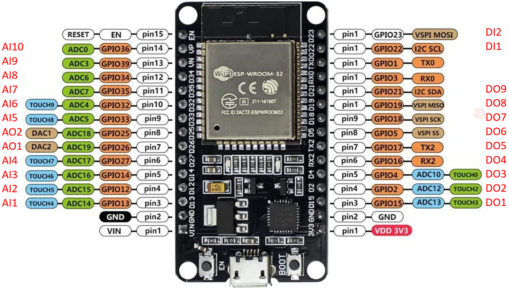

<!-- README_ESP32_SoftIOC.md -->
# ESP-WROON-32 SoftIOC
This project integrates the ESP32-WROON-32 chipboard into `EPICS`-based control system, and 
enable the analog inputs, analog outputs, digital inputs, and digital outputs of the 
corresponding pins from the `EPICS` control system.
The pinout is shown as follows. The PV channel mapped in the IOC is shown as
- `AI#` for `analog input`, 12-bit;
- `AO#` for `analog output`, 8-bit;
- `DI#` for `digital input`, 1-bit.
- `DO#` for `digital output`, 1-bit.



The pin used as an ADC channel provides a `12-bit` resolution (0-4095) of the 
input voltage reading in the range of [0, 3.3V], while the DAC channel has a resolution 
of `8-bit` (0-255) in the range of [0, 3.3V].
It should also be noted that the output voltage from the DAC is not really linear to the setting value, 
below 3.3 V, the output voltage is typical `0.2 V` lower than the setting value.

GPIO1 and GPIO3 are intentionly left unused, because it's likely conflict with the serial communication UART port. 
These two pins might be used as RT&RX pins.

## Materials used
- Hardware
  - [ESP-WROON-32 board](https://www.amazon.com/dp/B09XDMVS9N)
  - Micro USB Cable
- Software
  - [Arduino IDE](Micro USB Cable)
  - [EPICS base, V3.15.6](https://epics.anl.gov/base/index.php)
  - [EPICS Stream Device](https://paulscherrerinstitute.github.io/StreamDevice/index.html)
  - [EPICS asyn module](https://epics-modules.github.io/master/asyn/)
  - [EPICS calc module](https://github.com/epics-modules/calc)

## 1. Program and test the ESP32
### 1.1 Install ESP32 Add-on in Arduino IDE
To install Arduino IDE, refer to the [Arduino website](https://docs.arduino.cc/software/ide-v1) 
for downloading and installation.

The official Arduino IDE does not support the ESP32 by default, to use the Arduino IDE and
program ESP32, we need to [Install the ESP32 Board in Arduino IDE](https://randomnerdtutorials.com/installing-the-esp32-board-in-arduino-ide-windows-instructions/).
Detailed information can be found in the previous [link](https://randomnerdtutorials.com/installing-the-esp32-board-in-arduino-ide-windows-instructions/), 
and other boards can be similarly installed in Arduino IDE.

In this project, I installed the Windows version on a `Windows 10` laptop. 

### 1.2 Program the ESP32
1.2.1 Launch the Arduino IDE

After the Arduino IDE is installed, launch the IDE by double click the 
[ESP32_GPIO_HW.ino](./ESP32_GPIO_HW/ESP32_GPIO_HW.ino) file.

1.2.2 Connect the device and choose the right port

Connect the ESP32 to the computer. Clicking the pull-down button on top of the window, 
click the `Select the board and port`, in the boards, type in and choose `ESP32-WROOM-DA Module`, 
in the PORTs, choose the right port of the connected device. 
For example:


1.2.2 Upload the code

Click the `->` button on the top left of the IDE, to upload the program to the ESP32.


### 1.3 Test the board
Click the `.o..` on the top-right corner of the IDE to start a Serial Monitor. 
Set the baud rate to `115200`. Type in `DEBUG 12345` and press `Enter`, it should return `12345`.


If it works as expected, it's ready to be deployed as a serial device.

## 2. Deploy the SoftIOC
Connect the ESP32 to the SoftIOC server.

### 2.1 Check the path to the EPICS base and modules
- Check and modify (if needed) the path of `EPICS_BASE`, `CALC`, `ASYN`, and `STREAM` in the 
  `<TOP>/configure/RELEASE` file.
- Check the line of  `drvAsynSerialPortConfigure()` in `st.cmd` is set to the correct port.
- Check the baud rate is consistent with the device setting (where 115200 is the default setting 
  in the firmware just burnt.)

### 2.2 Make and run the IOC
Go to the <top> directory of the IOC, and run 
```
make
```
Go to `<top>/iocBoot/iocESP32_GPIO`, and run 
```
./st.cmd
```


## 3. GUI
Add the IOC server to the gateway or check and make sure the local `EPICS_CA_ADDR_LIST` 
includes the IOC server.
Run `medx -x ESP32.adl`; then click `ESP32_1` to open the `ESP32_Main.adl`.
The panel looks as follows.


## References
- [Installing the ESP32 Board in Arduino IDE](https://randomnerdtutorials.com/installing-the-esp32-board-in-arduino-ide-windows-instructions/)
- [Language Reference (Arduino.cc)](https://www.arduino.cc/reference/en/)
- [EPICS Record Reference Manual](https://epics.anl.gov/EpicsDocumentation/AppDevManuals/RecordRef/Recordref-1.html)
- [MEDM: Motif Editor and Display Manager](https://epics.anl.gov/extensions/medm/index.php)
